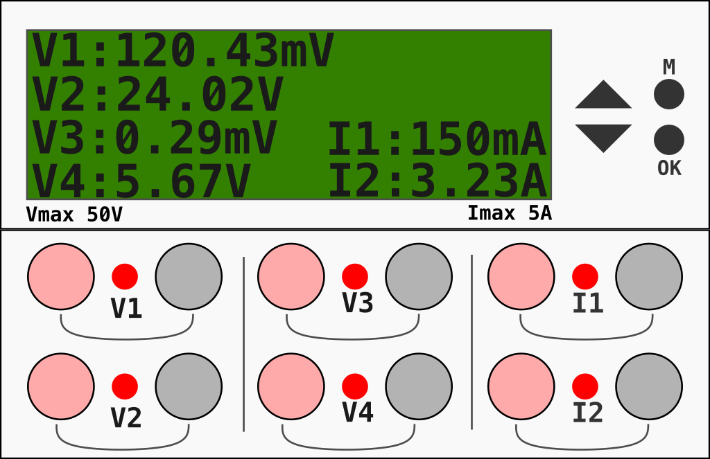

# MaVI

Instrument to measure Voltage and Current

## Electronic Design

## Voltage

Este diseño es para todas las entradas de voltaje

Como voltaje máximo se quiere que sean 50V.
El amplificador que colocaremos tendrá ganancia de 10.

De manera inicial se colocara una resistencia de 10k$\Omega$ la cual se medirá su voltaje el cual entrara a la entrada diferencial del amplificador operacional.
Como quiero que al impedancia de entrada sea muy alta, agregando resistencias de 1M$\Omega$, con esto logrando 4M$\Omega$, este valor de base, agregando la resistencia de 10k$\Omega$ que hago mención al inicio, ahora se debe ver cual resistencia agregar en serie con esta resistencia para ajustar el voltaje que entrara al operacional.

Haciendo el calculo de la corriente que pasara con base a las resistencias iniciales

$$Rt = (1M\Omega * 4) + 10k \Omega = 4.01 M \Omega$$

Ya con la resistencia total, podemos conocer la corriente que pasa en esa maya:

$$I = \frac{V}{R} = \frac{50V}{4.01M\Omega} = 12.46 \mu A$$

Con esto sabemos que la corriente maxima que vamos tener si estamos midiendo $50V$ de entrada será de $12.46 \mu A$

Con esto vamos a conocer el voltaje que pasar en la resistencia de $10k \Omega$.

$$V=RI = (10 k \Omega )(12.46 \mu A) = 124.6mV$$

Por lo tanto, en la resistencia R5 de $10k \Omega$ deben pasar $124.6mV$; pero necesitamos conocer si sera suficiente este voltaje de salida del amplificador, para el voltaje que llegara al ADC del ESP32.

Dado que la ganancia que manejaremos en el amplificador sera de 10, obtenemos el siguiente voltaje a la salida del amplificador.

$$Av = \frac{Rf}{Rs} = \frac{100k}{10K} = 10$$

$$V_{out} = (124.6mV)(10) = 1.246V$$

Pero, necesitamos $1.3V$ a la salida; por ende esto se ajusta fácilmente con un potenciómetro en seria a la resistencia de $10k \Omega$.
Estos $1.3V$ se necesitan por la salida que deseamos:

.

---

Volvemos a realizar las operaciones iniciales pero con los valores nuevos; quedando de la siguiente manera:

$$V_{out} = (130mV)(10) = 1.3V$$

Deben existir $130mV$ en la resistencia de $10k \Omega$.

---
Agregando un potenciómetro de $5k \Omega$ a la maya de la entrada:

$$Rt = (1M\Omega * 4) + 15k \Omega = 4.015 M \Omega$$

$$I = \frac{V}{R} = \frac{50V}{4.01M\Omega} = 12.454 \mu A$$

La resistencia que debería quedar ajustar para obtener los $130mV$

$$R_{ajustada} = \frac{V}{I} =\frac{130mV}{12.454 \mu A} = 10.43k \Omega$$

---

Para generar el offset hago un divisor de tension y un buffer, con esto es para ajustar el voltaje a $1.5V$

---

Los diodos que se colocan encontrados es para hacer un clamping, puesto que el voltaje sera de 130mV a la entrada y el diodo corta aproximadamente a 500mV o 600mV. Coloque 1N4148 por ser de alta velocidad.

### Current Módulo ACS712-5A

pendiente...

### Source

Se colocara una batería de 18650 con su cargador a 5V, colocando una fuente boots para alimentar el circuito a 5V.

[link](https://www.electrothinks.com/2024/02/tp4056-lithium-cell-charger-module.html)

## Log

Se guardaran los datos en una tarjeta SD
