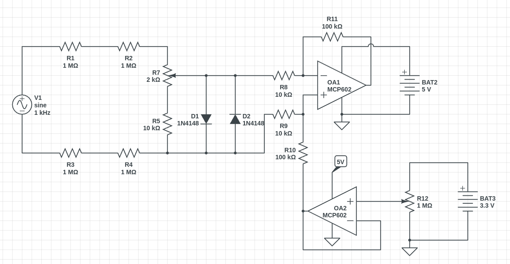

# 🔬 MaVI — Advanced Voltage and Current Meter

**Open-source instrument for precise voltage and current measurement.**  
Technical documentation, electronic design, firmware, and mechanical design.

---

## Schematic Overview

*Voltage measurement circuit — 4-channel divider network, MCP6002 gain stage, offset generation, and clamping protection.*

---

## Quick Navigation

-   :material-lightning-bolt:{ .lg .middle } __Electronic Design__

    ---

    Voltage measurement (0–50 V, 4 channels, MCP6002, 1N4148 clamping), current sensing (ACS712-5A), power system (18650 + TP4056), and SD card logging.

    [:octicons-arrow-right-24: Read more](electronic_design.md)

-   :material-chip:{ .lg .middle } __Firmware__

    ---

    UI screen mockups (Excalidraw), communication protocol diagrams, and planned features. Contributions welcome!

    [:octicons-arrow-right-24: Read more](firmware.md)

-   :material-printer-3d:{ .lg .middle } __Case & Enclosure__

    ---

    3D-printable enclosure design, front panel layout, UI screen flow, and LCD STEP model.

    [:octicons-arrow-right-24: Read more](case.md)

---

## Key Features

- :material-waveform: **4 voltage channels** — 0–50 V range with ~4 MΩ input impedance
- :material-current-ac: **Current sensing** — ACS712-5A hall-effect sensor (up to 5 A)
- :material-circle-opacity: **MCP6002 op-amp** — adjustable gain (×10) with 1.5 V offset
- :material-shield-alert: **Overvoltage protection** — 1N4148 clamping diodes
- :material-chip: **ESP32** — dual-core microcontroller with built-in ADC
- :material-monitor: **LCD 16×02 display** — alphanumeric user interface
- :material-battery-charging: **Rechargeable battery** — 18650 Li‑ion + TP4056 charger
- :material-sd: **SD card logging** — onboard data storage
- :material-volume-high: **Piezo buzzer** — audible alerts
- :material-printer-3d: **3D-printable enclosure** — custom case design

---

## Project Status

| Sheet / Component | Status |
|---|---|
| Voltage measurement circuit | :material-check-all:{ .green } **Complete** |
| Microcontroller (ESP32) | :material-circle-half-full:{ .yellow } Placeholder |
| Charger (TP4056) | :material-circle-half-full:{ .yellow } Placeholder |
| PCB layout | :material-circle-half-full:{ .yellow } In progress |
| Firmware | :material-progress-wrench: Not started |
| Enclosure design | :material-circle-half-full:{ .yellow } Early phase |

---

## Component Datasheets

- :material-file-pdf-box: [ACS712 — Hall-Effect Current Sensor](datasheets/ACS712.pdf)
- :material-file-pdf-box: [LCD-016N002B — 16×02 Character Display](datasheets/LCD-016N002B.pdf)
- :material-file-pdf-box: [TP4056 — Li‑ion Battery Charger](datasheets/TP4056.pdf)

---

## External Links

- :material-github: [GitHub Repository](https://github.com/jalmx/mavi)
- :material-web: [Author's Website](https://www.alejandro-leyva.com)
- :material-cube: [3D STEP Model — LCD](steps/LCD%20AP214.STEP)

---

## Author

**Alejandro Leyva (Xizuth)** — [@jalmx](https://github.com/jalmx)

  Built with :material-heart: using KiCad, MkDocs Material, and ESP32

